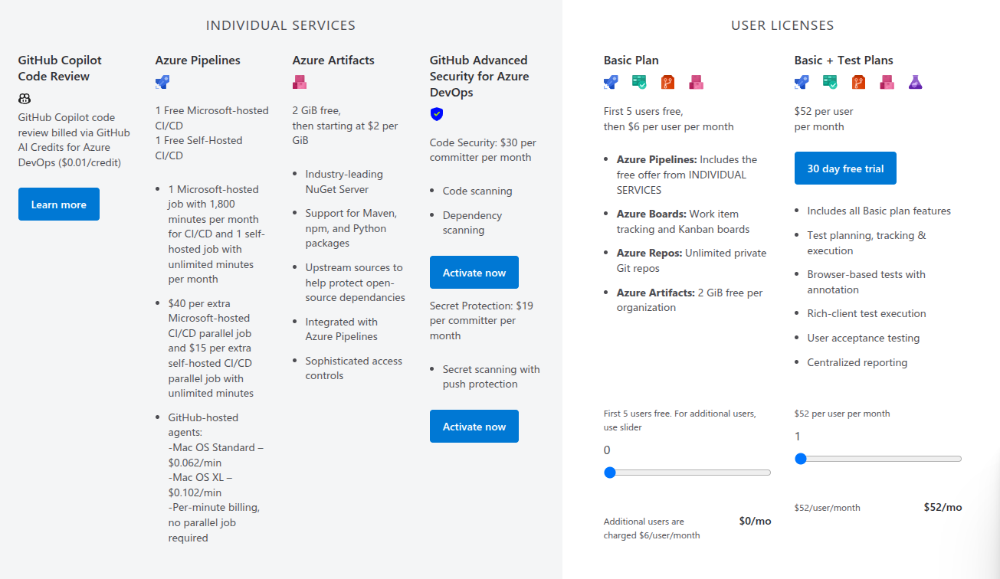

# Const Management

- Basic Plan is free

- 1 Free Microsoft-hosted CI/CD - 1 Free Self-Hosted CI/CD -
- 1 Microsoft-hosted job with 1,800 minutes per month for CI/CD and 1 self-hosted job with unlimited minutes per month
- means only one pipeline run at a time. If you want to run multiple pipelines simultaneously, you need to pay for additional parallel jobs. ( Also job means how many pipelines can run at the same time. 2 jobs means 2 pipelines can run at the same time. )

| Resource                                       | Scope                                 |
| ---------------------------------------------- | ------------------------------------- |
| 1 Free Microsoft-hosted CI/CD parallel job     | **Per organization**                  |
| 1 Free Self-hosted CI/CD parallel job          | **Per organization**                  |
| 1,800 Microsoft-hosted minutes/month           | **Shared by the entire organization** |
| Unlimited minutes for the free self-hosted job | **Shared by the entire organization** |
